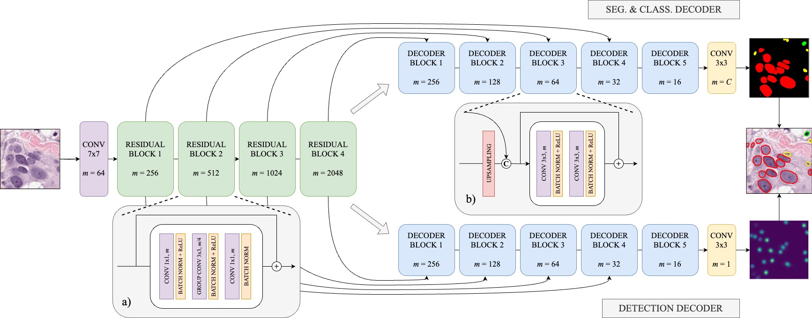

# Two Heads Are Enough: DualU-Net, a Fast and Efficient Architecture for Cell Classification and Segmentation (Under Construction)

DualU-Net is a multi-task deep learning model for nuclei segmentation and classification. It employs a dual-decoder design that predicts both pixel-wise segmentation maps and Gaussian-based centroid density maps, enabling fast and accurate instance segmentation in histopathological images.



> **Note**: This repository is under active development. Please anticipate frequent changes.

## Datasets

DualU-Net has been evaluated on several public datasets:

- **PanNuke**: A dataset for tissue and nuclei segmentation in histopathology.  
  [Link](https://arxiv.org/abs/2003.10778)
- **CoNSeP**: A colorectal cancer nuclei segmentation dataset.  
  [Link](https://github.com/vqdang/hover_net)

## Results and Checkpoints

| Dataset  | Encoder              | Detection F1 | Classification F1 | Dice  | Checkpoint Link |
|----------|----------------------|-------------|------------------|-------|----------------|
| CoNSeP   | ResNeXt50_32x4d      | 0.72        | 0.56             | 0.76  | [Download](https://drive.google.com/file/d/1v10hZvHK51V2u7QdqW5cU_EiLZ8KsvAv/view?usp=sharing) |                                   
| CoNSeP   | ConvNeXt_base        | 0.72        | 0.54             | 0.80  | [Download](https://drive.google.com/file/d/13KhPec60ctwBr7C-XjR1ah6H7cD800Q9/view?usp=sharing) |                                  
| PanNuke  | ResNeXt50_32x4d      | 0.80        | 0.54             | 0.77  | [Download](https://drive.google.com/drive/folders/1vnAJgmoaRf0I2C9HVWl-vM4ClsMAhH9T?usp=drive_link) |                                  
| PanNuke  | ConvNeXt_base        | 0.80        | 0.55             | 0.74  | [Download](https://drive.google.com/drive/folders/1shCvv29LDLxHygALOMqUIpfjIEAaaBhz?usp=sharing) |


### PanNuke Checkpoints Information

The provided **PanNuke** checkpoints are trained on one fold of the dataset, validated on another, and tested on the third. The naming convention of the checkpoints follows this pattern:

**`pannuke-combined-{encoder}-{train_fold}{val_fold}.pth`**

- **`{encoder}`**: Specifies the encoder used in the model (e.g., `convnext`).
- **`{train_fold}`**: Indicates the fold used for training.
- **`{val_fold}`**: Indicates the fold used for validation.

For example, the checkpoint:
  
  **`pannuke-combined-convnext-23.pth`**  
  - *Trained on fold 2*
  - *Validated on fold 3*
  - *Tested on fold 1*
  - *Uses ConvNeXt as the encoder*


### CoNSeP Checkpoints Information

For **CoNSeP**, the checkpoint follows a simpler naming convention:

**`consep-combined-{encoder}.pth`**

- **`{encoder}`**: Specifies the encoder used in the model (e.g., `convnext`).

For example:
  
  **`consep-combined.pth`**  
  - **Trained on the full CoNSeP dataset**  
  - **Uses a combined training approach**


## Installation

1. **Clone** this repository:
   ```bash
   git clone https://github.com/davidanglada/DualU-Net.git
   ```

2. **Create a virtual environment**:
   ```bash
   python -m venv dualunet-env
   source dualunet-env/bin/activate  # On Windows use `dualunet-env\Scripts\activate`
   ```

3. **Install required dependencies**:
   ```bash
   pip install -r requirements.txt
   ```

---

## Basic Usage

### 1. Project Structure

```
DualU-Net/
├── dual_unet/                         # Main module containing core functionalities
│   ├── datasets/                      # Dataset building from COCO, transforms and augmentation
│   ├── eval/                          # Detection and segmentation evaluation functions.
│   ├── models/                        # Contains model architectures and related utilities
│   ├── utils/                         # Contains utility functions
│   ├── __init__.py                    # Initialization file for the dual_unet module
│   └── engine.py                      # Train and evaluation functions
├── configs/                           # Configuration files
│   ├── train_config.yaml              # Configuration file for training
│   ├── eval_config.yaml               # Configuration file for evaluation
├── eval.py                            # Script for evaluating the model
├── train.py                           # Script for training the model
├── requirements.txt                   # List of required Python packages
└── README.md                          # Project documentation
```

Below are the basic commands to get you started with DualU-Net.

### 2. Training

```bash
python train.py --config configs/train_config.yaml
```

### 3. Inference & Evaluation

```bash
python eval.py --config configs/eval_config.yaml
```

## Citation
If you find this work helpful in your research, please consider citing us:
```bash
   @inproceedings{
      anglada-rotger2025dualunet,
      title={Two Heads Are Enough: DualU-Net, a Fast and Efficient Architecture for Nuclei Instance Segmentation},
      author={David Anglada-Rotger and Berta Jansat and Ferran Marques and Montse Pard{\`a}s},
      booktitle={Submitted to Medical Imaging with Deep Learning},
      year={2025},
      url={https://openreview.net/forum?id=lK0CklgxQd},
      note={under review}
   }
```

## License
[](LICENSE)

This project is licensed under the [MIT License](LICENSE).